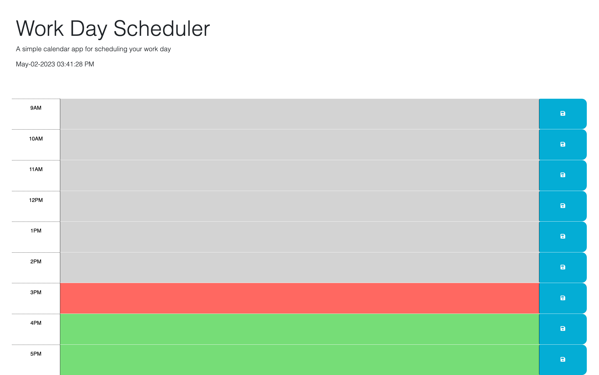

# Daily scheduler

## Creating a Daily Scheduler to help software developers organize their day.

This is a Daily Scheduler that organizes one's events by the hour. It includes:
- Color coordinated time slots that displays the past, current and future hour.
- Allows you to save the event into local storage.
- Displays the current date and time at the top. 

## Installation

N/A

## Usage
- This is the link to the deployed website
https://darvinmarte.github.io/daily-scheduler/

## Credits

N/A

## License

Please refer to the LICENSE in the repo.